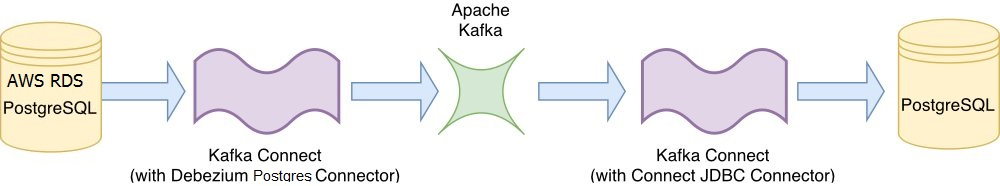
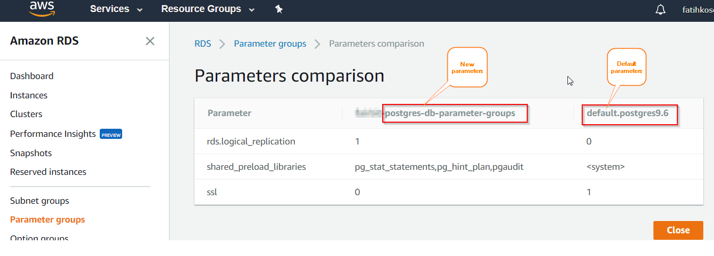
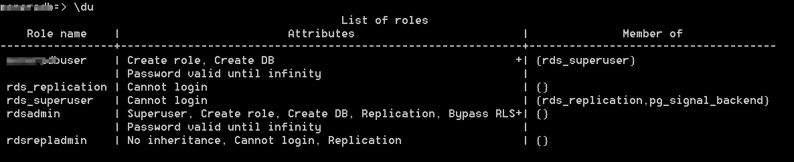
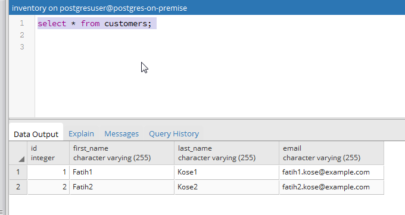

# debezium-aws-rds-config-scripts

# A Step-by-Step Guide on Streaming Data from AWS RDS Multi-AZ PostgreSQL DB to a Standlone PostgreSQL DB Using Debezium 0.7.1 Connector :

In this guide, I will share my experience on integrating AWS RDS PostgreSQL and Debezium Kafka 
Connector. So we will be able to stream data from AWS RDS PostgreSQL to an another standlone 
PostgreSQL DB on AWS EC2 Server.

Before working with Debezium, you need to make a decision on which connector will be "Source Connector" and 
which one will be "Sink Connector". In our example, "Source Connector" will connect to "AWS RDS Multi-AZ PostgreSQL DB, 
and "Sink Connector" will connect to Standlone PostgreSQL DB. 

Actually, the configuration below supports two-way connectors as well. Please keep in mind that only a single 
Debezium Kafka Connector can serve multiple tasks, it means to be able to use the same connector as source and 
sink  and can work one-to-many, many-to-one, one-to-one ways. 

Note : You can download the necessary debezium AWS RDS config scripts from https://github.com/fatihmehmetkose/debezium-aws-rds-config-scripts

---
### Prerequisites:
To be able to understand all the concepts mentioned here properly, you should be familiar with the systems 
like; debezium, docker, docker-compose, AWS RDS, PostgreSQL, Apache Kafka, Linux.
The guide assumes that you have setup an instance on AWS and installed the necessary apps on it. 
Before we go;
1. First, you need to create an AWS EC2 Instance with Amazon Linux AMI as explained at this link. 
`https://docs.aws.amazon.com/AWSEC2/latest/UserGuide/launching-instance.html`

2. Second, it is required to install docker on the machine as explained at this link. 
`https://docs.aws.amazon.com/AmazonECS/latest/developerguide/docker-basics.html`

3. Lastly, it is required to install docker compose as explained at this link.
`https://docs.docker.com/compose/install/#install-compose`
---

 
 

## 1. Streaming Data From AWS RDS PostgreSQL DB to PostgreSQL DB:

---
### 1.1 Topology

 
---

 
 

### 1.2 AWS RDS PostgreSQL DB Configuration

1. Create a new "Parameter Group" at AWS RDS ***Parameter groups*** section and give it a name , for example, "postgres-db-parameter-groups"

2. Be sure to set the new ***Parameter Group*** parameters as follows:
    
 
	
	
----
	rds.logical_replication = 1
    shared_preload_libraries = pg_stat_statements,pg_hint_plan,pgaudit
    ssl=0
----

* 3 - Create a new AWS RDS PostgreSQL DB called testdbserver. Set the user name as ***testdbuser***. 
Give permission to Port Number ***TCP:5432*** to all sources (0.0.0.0/0) via ***DB Security Group***.

 

4. Connect to the database via psql 

----
    [ec2-user@hostname ~] $ psql -h testdbserver.cuwbhrbzgqk9.us-east-1.rds.amazonaws.com -d testdb -U testdbuser -p 5432
----

5. Type \d to see a screen like that and be sure that  your user testdbuser is a member of rds_superuser and rds_superuser has ***rds_replication*** right

    `testdb=> \du`
    
	 
	

6. Display if any replication slots are available

    `testdb=> select * from pg_replication_slots;`

7. Create a replication plugin called ***wal2json*** and name it ***wal2json_rds***

    `testdb=> SELECT * FROM pg_create_logical_replication_slot('wal2json_rds', 'wal2json');`

8. If you wanna delete the slot type this
    
    `testdb=> SELECT pg_drop_replication_slot('wal2json_rds');`

9. Create a table named ***customers***

    `testdb=> CREATE TABLE customers (id SERIAL,  first_name VARCHAR(255) NOT NULL,  last_name VARCHAR(255) NOT NULL,  email VARCHAR(255) NOT NULL,  PRIMARY KEY(id));`

10. Change table so that it can ***support replication***

    `testdb=> ALTER TABLE customers REPLICA IDENTITY FULL;`

11. ***Insert some records*** into the source table

----
    testdb=> insert into customers values(default, 'fatih1', 'kose1', 'fatih1.kose@example.com');
    testdb=> insert into customers values(default, 'fatih2', 'kose2', 'fatih1.kose@example.com');
----

### 1.3 Prepare Debezium Test Environment And Complete Configuration On Linux

1. Create a directory under user home directory 

    `[ec2-user@hostname ~] $ mkdir ~/debezium`

2. Download the sample config scripts from ***https://github.com/fatihmehmetkose/debezium-aws-rds-config-scripts*** and copy them into that directory

    `[ec2-user@hostname ~] $ cp *.zip debezium/`

3. Enter into that directory

    `[ec2-user@hostname ~] $ cd debezium`

4. ***export DEBEZIUM_VERSION*** environment variable

    `[ec2-user@hostname ~] $ export DEBEZIUM_VERSION=0.7.1`

5. ***Build docker-compose files*** named docker-compose.yaml (default name)

    `[ec2-user@hostname ~] $ docker-compose build`

6. ***Start the docker*** containers. Applications running on containers are ***Zookeper, Apache Kafka, Debezium Kafka Connector, PostgreSQL db***. 

    `[ec2-user@hostname ~] $ docker-compose up`

7. Create a table named ***customers*** on target or sink PostgreSQL db

    `[ec2-user@hostname ~] $ docker-compose -f docker-compose.yaml exec postgres bash -c 'psql -U $POSTGRES_USER $POSTGRES_DB -c "CREATE TABLE customers (id SERIAL,  first_name VARCHAR(255) NOT NULL,  last_name VARCHAR(255) NOT NULL,  email VARCHAR(255) NOT NULL,  PRIMARY KEY(id));"'`

8. ***Start target PostgreSQL DB connector*** running in a container

    `[ec2-user@hostname ~] $ curl -i -X POST -H "Accept:application/json" -H  "Content-Type:application/json" http://localhost:8083/connectors/ -d @jdbc-sink.json`

9. ***Start source AWS RDS PostgreSQL DB connector***

    `[ec2-user@hostname ~] $ curl -i -X POST -H "Accept:application/json" -H  "Content-Type:application/json" http://localhost:8083/connectors/ -d @source-postgres.json`

10. ***Verify*** that the connector definitions are added to the debezium connector
    
	`[ec2-user@hostname ~] $ curl -H "Accept:application/json" localhost:8083/connectors/`

11. ***Verify*** that the PostgreSQL database has the same content as in AWS RDS PostgreSQL DB:

    `[ec2-user@hostname ~] $ docker-compose -f docker-compose.yaml exec postgres bash -c 'psql -U $POSTGRES_USER $POSTGRES_DB -c "select * from customers"'`

12. Optionally, if you wanna display the current db name, run the following command 

    `[ec2-user@hostname ~] $ docker-compose -f docker-compose.yaml exec postgres bash -c 'psql -U $POSTGRES_USER $POSTGRES_DB -c "SELECT current_database();"'`

13. Optionally, If you wanna login into PostgreSQL DB container with an of "f86dfa1bba34", run the following command 

    `[ec2-user@hostname ~] $ docker exec -it f86dfa1bba34 bash`

14. Optionally, if you wanna ***restart the servers***, press ***Ctrl +C*** and run the following command again

----
    [ec2-user@hostname ~] $ export DEBEZIUM_VERSION=0.7.1
    [ec2-user@hostname ~] $ docker-compose down
    [ec2-user@hostname ~] $ docker-compose up
----

### 1.4 Prepare Postgresql Standalone Db Environment As A Source And Target(Sink) At The Same Time For Debezium Connector On Linux

Ref : https://linode.com/docs/databases/postgresql/how-to-install-postgresql-relational-databases-on-centos-7/

1. Install ***PostgreSQL 9.6.5***

----
    [ec2-user@hostname ~] $ sudo yum update
    [ec2-user@hostname ~] $ cd ~
    [ec2-user@hostname ~] $ wget https://download.postgresql.org/pub/repos/yum/9.6/redhat/rhel-7-x86_64/pgdg-centos96-9.6-5.noarch.rpm
    [ec2-user@hostname ~] $ sudo yum install pgdg-centos96-9.6-5.noarch.rpm epel-release
    [ec2-user@hostname ~] $ sudo yum update
    [ec2-user@hostname ~] $ sudo yum install postgresql96-server postgresql96-contrib
----

2. Login as postgres ***linux user***. 

    `[ec2-user@hostname ~] $ sudo -i -u postgres`

3. ***Start PostgreSQL DB server***

    `[ec2-user@hostname ~] $ /usr/lib64/pgsql96/bin/initdb -D /var/lib/pgsql96/data`

4. Check out db server status

    `[ec2-user@hostname ~] $ /usr/lib64/pgsql96/bin/pg_ctl status -D /var/lib/pgsql96/data`

5. Restart db server if needed

    `[ec2-user@hostname ~] $ /usr/lib64/pgsql96/bin/pg_ctl restart -D /var/lib/pgsql96/data`

6. ***Set password for postgres linux user***

    `[ec2-user@hostname ~] $ sudo passwd postgres`

7. ***Set password for postgres db user***
    
	`-bash-4.2$ psql -d template1 -c "ALTER USER postgres WITH PASSWORD 'postgres';"`

8. Create a user named ***postgresuser***

    `-bash-4.2$ createuser postgresuser`

9. Create a db named ***inventory***

    `-bash-4.2$ $ createdb inventory -O postgresuser`

10. Set the new user's password
 
     `-bash-4.2$ psql -d inventory -c "ALTER USER postgresuser WITH PASSWORD 'postgrespw';"`

11. ***Connect*** to inventory db

    `-bash-4.2$ psql inventory`
 
12. Some useful commands

----
    `testdb=> \l'
		
		\l : list all databases
		\h : list all command
		\du : show user roles
		\c : show connection info
----

13. Go to db folder

    `-bash-4.2$ cd /var/lib/pgsql96/data/`

14. open ***pg_hba.conf*** config file and change it as follows

----
    -bash-4.2$ vim pg_hba.conf`
    *pg_hba.conf vi editor*`
	*IPv4 local connections:*`
	host    all             all             0.0.0.0/0               md5
	-# Allow replication connections from localhost, by a user with the
	-# replication privilege.
	-#local   replication     postgres                                trust
	-#host    replication     postgres        127.0.0.1/32            trust
	-#host    replication     postgres        ::1/128                 trust
	host     replication     postgresuser    0.0.0.0/0               md5
	*pg_hba.conf vi editor*
    

15. open ***postgresql.conf*** config file and change it as follows

----
    -bash-4.2$ vim postgresql.conf
    ------ postgresql.conf vi editor ------
	listen_addresses = '*'
	port = 5432
	ssl = off
	wal_level = logical
	max_wal_senders = 1
	max_replication_slots = 1
	------ postgresql.conf vi editor ------
----

16. Restart the server to apply changes

    `-bash-4.2$ /usr/lib64/pgsql96/bin/pg_ctl restart -D /var/lib/pgsql96/data`

17. Connect to the new db with the new user

    `-bash-4.2$ psql -d inventory -U postgresuser`

18. Give ***REPLICATION*** and ***SUPERUSER***(not mandatory) rights to the new user.

----
    testdb=> ALTER ROLE postgresuser WITH SUPERUSER;
    testdb=> ALTER ROLE postgresuser WITH REPLICATION;
----

19. Add your user postgres to the ***sudoers*** group

----
    [ec2-user@hostname ~] $ usermod -aG wheel postgres
    [ec2-user@hostname ~] $ cat /etc/sudoers
----

20. Allow wheel user group to run all commands on linux via ***visudo*** command

----
    [ec2-user@hostname ~] $ visudo`
    ------* visudo editor for sudo ------***`
	 -# Open wheel line`
	 -## Allows people in group wheel to run all commands`
	 %wheel        ALL=(ALL)       ALL`
	------* visudo ------***
----

21. Find postgres development tools to ***compile wal2json plugin***

----
    [ec2-user@hostname ~] $ yum list postgres*
    [ec2-user@hostname ~] $ sudo yum install postgresql96-devel.x86_64
    [ec2-user@hostname ~] $ yum list gcc*
    [ec2-user@hostname ~] $ sudo yum install gcc.noarch
----

22. Install git tool to ***download wal2json plugin code*** from the repository below.

----
    [ec2-user@hostname ~] $ sudo yum install git
    [ec2-user@hostname ~] $ sudo -i -u postgres
    -bash-4.2$ git clone https://github.com/eulerto/wal2json.git
----

23. ***Compile wal2json plugin***

----
    -bash-4.2$ cd wal2json/
    -bash-4.2$ PATH=/path/to/bin/pg_config:$PATH
    -bash-4.2$ USE_PGXS=1 make
    -bash-4.2$ sudo /usr/bin/install -c -m 755  wal2json.so '/usr/lib64/pgsql96/'
    > The same thing with (USE_PGXS=1 make install )
----

24. ***Create a replication slot*** named ***wal2json_rds*** using the plugin ***wal2json***.

----
    -bash-4.2$ psql inventory -U postgresuser
    testdb=> SELECT * FROM pg_create_logical_replication_slot('wal2json_rds', 'wal2json');
    testdb=> SELECT * FROM pg_replication_slots;
----

25. Check out your ***wal_level***, you must see ***logical***

    `testdb=> show wal_level;`

---
## RESULT

** As you can see, the records inserted from AWS RDS PostgreSQL DB are replicated to the target PostgreSQL DB.**

 
